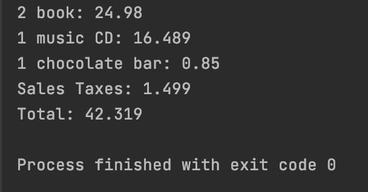

# Sales Tax Problem
> This application processes items in a receipt given their name, quantity, price and outputs a list of items along with the total cost and total sales tax.

### Packages:
* Controllers:
    * InputReader: reads the data from the input file and returns a list of items.
    * ItemProcessor: processes the items in an item list - feeds each item into the matchCategory method from CategoryMatching.
    * CategoryMatching: creates a map that includes the necessary categories. Provides a matchCategory method that matches given item to its category.
* Models: Item, TaxItem, Receipt.

### Running the Code:
1. Clone this repository:
```
    git clone https://github.com/by-bai/sales-tax.git
```

2. Run App.java
* Outputs of the Receipt will be printed in your console.

### Sample Output:

---